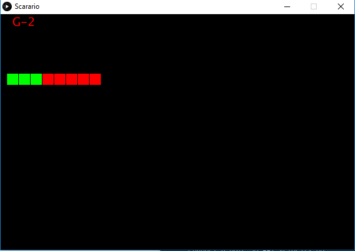

# Scarario

## What?

**Scarario** is a musical scale-trainer to be used with a MIDI-keyboard, written in Processing. :musical_keyboard: :musical_score: :musical_note:

It is currently mainly a PoC (Proof of Concept) for experimenting with some programming-techniques. :construction:

## How?

Pressing `s` starts a new *game*. The student then has to play the required minor scale (8 notes) without errors.
When all notes are played correctly, all squares will become green. If an error is made, all squares become red again.

## Future plans

- *Practice Sessions* without the need for a (computer-)keyboard but completely controlled by the MIDI-keyboard
- It should remember which scales the student has the most problems with and only ask those again
- More programming experiments :wink:
